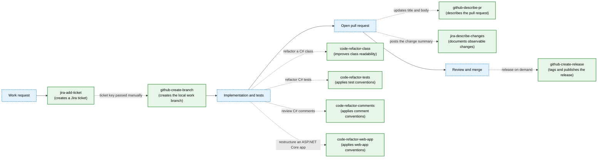

# Prompt Skills

This directory contains reusable skills for C# refactoring and common GitHub and Jira workflows.
Each skill lives in its own directory under `skills/`, with its entry-point instructions in a
`SKILL.md` file.

## Available skills

### Code quality

| Skill | Version | Purpose |
|---|---:|---|
| [`code-refactor-class`](skills/code-refactor-class/SKILL.md) | 0.5.0 | Refactors a C# class for consistent abstraction levels, focused private methods, meaningful names, and aligned XML documentation while preserving behavior and non-private signatures. |
| [`code-refactor-comments`](skills/code-refactor-comments/SKILL.md) | 0.3.0 | Audits C# comments, removes narration and duplication, preserves non-obvious intent, and applies the shared comment conventions. |
| [`code-refactor-tests`](skills/code-refactor-tests/SKILL.md) | 1.7.0 | Writes, formats, reviews, or refactors C# unit tests using the shared naming, AAA, setup, assertion, helper, and coverage conventions. |
| [`code-refactor-web-app`](skills/code-refactor-web-app/SKILL.md) | 0.1.0 | Refactors an ASP.NET Core application toward the repository's layered web-application structure while preserving behavior and dependency direction. |

### GitHub workflows

| Skill | Version | Purpose |
|---|---:|---|
| [`github-create-branch`](skills/github-create-branch/SKILL.md) | 0.2.0 | Creates or reuses a local feature or bug branch derived from a Jira ticket or GitHub issue. |
| [`github-create-release`](skills/github-create-release/SKILL.md) | 0.3.0 | Verifies a release commit and CI-generated version, then creates the confirmed tag and GitHub release. |
| [`github-describe-pr`](skills/github-describe-pr/SKILL.md) | 1.1.0 | Produces a ticket-grounded pull-request title and description and updates the PR after confirmation. |

### Jira workflows

| Skill | Version | Purpose |
|---|---:|---|
| [`jira-add-ticket`](skills/jira-add-ticket/SKILL.md) | 0.2.0-alpha | Drafts, previews, and creates a Bug, Task, or Story from user-provided requirements. |
| [`jira-describe-changes`](skills/jira-describe-changes/SKILL.md) | 1.5.0 | Summarizes a pull request's observable changes and posts the confirmed summary to the appropriate Jira or GitHub destination. |

## How the skills fit together

The diagram shows a typical delivery flow and the optional code-quality passes available during
implementation. Solid arrows represent workflow progression. Dashed arrows represent manual
handoffs or optional skill use; they do not imply that one skill automatically invokes another.

## Shared references

The code-refactoring skills use these maintained conventions:

- [Code comments conventions](references/code-comments-conventions.md)
- [Unit test conventions](references/code-unit-tests-conventions.md)
- [Web application conventions](references/code-web-app-conventions.md)

## Installation

Run [`scripts/update-skills.py`](scripts/update-skills.py) to copy the skills and shared references into
the supported local assistant directories that already exist.
